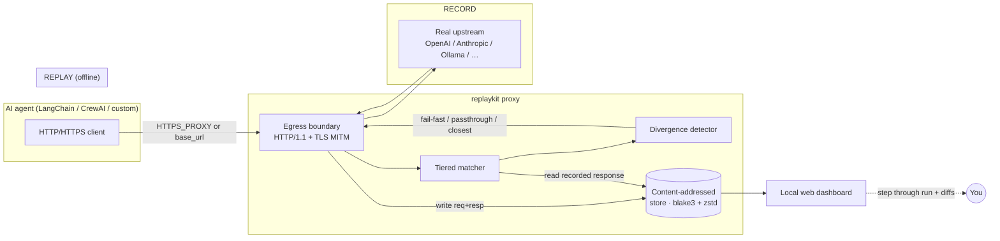

<div align="center">

# 🎞️ replaykit

**A deterministic record-and-replay proxy for AI agents.**

*Freeze the world, reproduce any run.*

[](https://github.com/aryxnsdfs/replaykit/actions/workflows/ci.yml)
[](https://github.com/aryxnsdfs/replaykit/actions/workflows/release.yml)
[](LICENSE)
[](https://www.rust-lang.org)

</div>

---

replaykit records all traffic between an AI agent and the outside world (LLM APIs **and** tool
APIs), then replays those exact responses offline so any agent run is **perfectly reproducible
and debuggable**.

```
  RECORD                                   REPLAY (offline)
  ┌───────┐   ┌───────────┐   ┌──────┐     ┌───────┐   ┌───────────┐   ┌──────────┐
  │ agent │──▶│ replaykit │──▶│ real │     │ agent │──▶│ replaykit │──▶│ cassette │
  │       │◀──│   proxy   │◀──│ API  │     │       │◀──│   proxy   │◀──│  (disk)  │
  └───────┘   └─────┬─────┘   └──────┘     └───────┘   └─────┬─────┘   └──────────┘
                    │ writes                                  │ matches & detects
                    ▼                                         ▼ divergence
                 cassette                                  same inputs → same bug
```

## 30-second start

```bash
# 1. Install (Linux/macOS). Windows: see Installation below.
curl -fsSL https://raw.githubusercontent.com/aryxnsdfs/replaykit/main/install.sh | sh

# 2. Run your agent through it. Records the first time, replays offline after.
replaykit run --cassette runs/demo --preset openai -- python my_agent.py
```

That's the whole loop. Swap `--preset openai` for `anthropic`, `google`,
`ollama`, `vllm`, or `lmstudio`; swap the command for whatever launches your
agent. [Recipes for every provider below.](#run-any-agent)

## The problem

AI agents are non-deterministic: the same task gives a different result every run, because the
LLM API, the tool APIs, the clock, and randomness all change between runs. So when an agent
fails, developers **can't reproduce the failure — and can't debug what they can't reproduce.**

Existing tools (LangGraph, CrewAI) only checkpoint the agent's internal **state**; on replay the
agent still calls the **live world**, so conditions have already changed. replaykit fixes this by
freezing the **world**: it records everything coming back over the wire, then feeds the exact same
responses back on replay.

> **Same inputs → same behavior → the bug reappears.**

## How it works

replaykit is a tape recorder at the **egress boundary**. It captures every request the agent
sends out and every response it gets back, in full, byte-for-byte — no judgement about what's
"important", and never inspecting the agent's internals. Only what crosses the network door.

1. **Install** — one command (single binary).
2. **One-time setup** — `replaykit setup` creates and trusts a local CA so HTTPS traffic from
   cloud APIs can be read. (Skipped automatically for local HTTP-only model servers.)
3. **Point the agent at the proxy** — either set `HTTPS_PROXY=http://localhost:PORT`, or set the
   SDK's `base_url` to the proxy with a provider preset.
4. **Record** — `replaykit record --preset openai --out ./runs/today`, then run the agent
   normally. Nothing changes for you — the agent talks to the real world; replaykit silently
   saves everything.
5. **The agent breaks.**
6. **Replay** — `replaykit replay --run ./runs/today`. You can disconnect the internet. replaykit
   returns the saved responses; the agent behaves identically; the bug reappears.
7. **Inspect** — open the local web dashboard to step through the run and see exactly where it
   went wrong (and any divergence).

## Architecture



**Components**

- **Proxy core** (`src/proxy`) — a hyper-based HTTP/1.1 proxy. It handles `CONNECT` (HTTPS via
  MITM with a minted leaf cert), absolute-form requests (HTTP forward proxy), and origin-form
  requests (reverse proxy in front of one `--upstream`). One server, every integration style.
- **Cassette** (`src/cassette`) — content-addressed, zstd-compressed storage. Bodies are split
  into content-defined chunks (a FastCDC-style gear hasher), each unique chunk stored once keyed
  by blake3. Interactions stream to an append-only log; memory stays flat.
- **Matcher** (`src/matcher`) — tiered semantic request matching (below).
- **Divergence** (`src/divergence`) — detects when a replayed request matches nothing or matches
  out of order, with a diff and a configurable policy.
- **Dashboard** (`src/dashboard`) — a single-page UI with assets embedded in the binary.

## Quickstart

### Easiest: one command, one shell

```bash
# Record on first run, replay on every run after.
replaykit run --cassette runs/today --preset openai -- python my_agent.py
```

`replaykit run` spawns the proxy on a free port, wires `HTTP_PROXY`,
`HTTPS_PROXY`, `OPENAI_BASE_URL`, `ANTHROPIC_BASE_URL`, `GEMINI_PROXY`,
`GOOGLE_GENAI_BASE_URL`, and `REPLAYKIT_PROXY` into the child's environment,
runs your command, then shuts down. No second terminal, no process juggling,
no PATH tricks. Re-run the same line — second time round it serves from the
cassette and never touches the network.

Force a fresh recording with `--record`. Force replay with `--replay`.

## Run *any* agent

replaykit is provider-agnostic. It sits on the network boundary, so **any agent
that makes HTTP(S) calls works** — OpenAI, Anthropic, Gemini, local model
servers (Ollama / vLLM / LM Studio), tool APIs, or your own custom client.
Frameworks (LangChain, LlamaIndex, CrewAI, AutoGen, raw SDK) don't matter:
they all speak HTTP underneath.

The pattern is always the same:

```bash
replaykit run --cassette runs/<name> --preset <provider> -- <your agent command>
```

First run records against the real provider; every run after replays offline.
`<your agent command>` is whatever you'd normally type — `python app.py`,
`node agent.js`, `./my-agent`, etc.

### OpenAI

```bash
replaykit run --cassette runs/openai --preset openai -- python my_agent.py
```
Your agent reads `OPENAI_BASE_URL` (the official SDK does) — `run` sets it to
the proxy automatically. No code change.

### Anthropic (Claude)

```bash
replaykit run --cassette runs/claude --preset anthropic -- python my_agent.py
```
Sets `ANTHROPIC_BASE_URL`. Works with the `anthropic` SDK out of the box.

### Google Gemini

```bash
replaykit run --cassette runs/gemini --preset google -- python my_agent.py
```
If your code reads `GEMINI_PROXY` / `GOOGLE_GENAI_BASE_URL`, it's wired
automatically. With the official `google-genai` SDK, point its `base_url`/
`http_options` at `$REPLAYKIT_PROXY` (also exported by `run`).

### Local models — Ollama / vLLM / LM Studio (no API key, no CA)

Local servers speak plain HTTP, so there's no TLS to intercept and no CA to
install. This is the easiest path of all:

```bash
# Ollama (default http://localhost:11434)
replaykit run --cassette runs/ollama --preset ollama -- python my_agent.py

# vLLM (default http://localhost:8000)
replaykit run --cassette runs/vllm --preset vllm -- python my_agent.py

# LM Studio (default http://localhost:1234)
replaykit run --cassette runs/lmstudio --preset lmstudio -- python my_agent.py
```

vLLM and LM Studio expose an OpenAI-compatible API, so most OpenAI agents work
unchanged — just point the SDK's `base_url` at the proxy (`$REPLAYKIT_PROXY`)
or rely on the `OPENAI_BASE_URL` that `run` exports.

> **Note:** replaykit captures traffic at the *network* boundary. If a model
> runs **in the same process** (e.g. `transformers` or `llama-cpp-python` with
> no HTTP server), there's no wire to record. Run the model as a server
> (Ollama/vLLM/LM Studio all do this) and point your agent at it.

### Custom / self-hosted endpoint

No preset? Give the upstream directly:

```bash
replaykit run --cassette runs/custom --upstream https://my-llm.example.com -- python my_agent.py
```

### Making your agent talk to the proxy

`run` exports these into your command's environment — most SDKs pick one up
with **zero code change**:

| Env var | Used by |
|---|---|
| `OPENAI_BASE_URL` | OpenAI SDK, vLLM, LM Studio, most OpenAI-compatible clients |
| `ANTHROPIC_BASE_URL` | Anthropic SDK |
| `GEMINI_PROXY`, `GOOGLE_GENAI_BASE_URL` | Gemini agents |
| `HTTP_PROXY` / `HTTPS_PROXY` | anything that respects proxy env (requests, httpx, curl, Go, Node) |
| `REPLAYKIT_PROXY` | read it yourself if your client needs an explicit base URL |

If your client ignores all of these, read `REPLAYKIT_PROXY` in your code and
pass it as the `base_url`. Example (Gemini):

```python
import os
from google import genai
client = genai.Client(
    api_key=os.environ["GEMINI_KEY"],
    http_options={"base_url": os.environ.get("REPLAYKIT_PROXY")},
)
```

### Verify a replay worked

On replay, every response carries headers you can assert on:

```
x-replaykit-mode:  replay      # served from disk, not the network
x-replaykit-tier:  exact       # how it matched (exact/normalized/structural/similarity)
x-replaykit-step:  0           # which recorded interaction was served
```

And the full report lands at `runs/<name>/last-replay.json` (tier hit rates,
divergence reasons, per-step outcomes). Browse it visually:

```bash
replaykit dashboard --run runs/<name>
```

## Run in the background (daemon)

`replaykit run` wraps a single command. The **daemon** is the always-on version:
start it once, then code and run your agents normally — no special command, no
wrapper. Known calls are served offline; brand-new calls are forwarded live and
**recorded on the fly**, so the cassette grows as you work.

```bash
# Start it (foreground). Point your agents at it as usual.
replaykit daemon --preset openai --cassette runs/auto --port 8080
```

Then in your normal shell/editor, run agents exactly as you always do — just
make sure they reach the proxy (set once in your shell profile, or per project):

```bash
export OPENAI_BASE_URL=http://localhost:8080/v1   # or HTTPS_PROXY=http://localhost:8080
python my_agent.py        # 1st time: records new calls. Next time: served offline.
```

### Start it detached (truly in the background)

**Windows (PowerShell)**
```powershell
Start-Process replaykit -ArgumentList 'daemon','--preset','openai','--cassette','runs/auto' -WindowStyle Hidden
# stop it later:
Get-Process replaykit | Stop-Process
```

**macOS / Linux**
```bash
nohup replaykit daemon --preset openai --cassette runs/auto --port 8080 >/tmp/replaykit.log 2>&1 &
echo $!   # PID; kill it later with: kill <PID>
```

**Run at login (optional):** drop the same command into a Windows *Startup*
shortcut / Task Scheduler task, a macOS LaunchAgent, or a Linux systemd
user-service. One daemon can serve every agent on the machine.

> **How it picks a cassette:** a network proxy can't see your project folder, so
> the cassette is whatever you pass to `--cassette`. For per-project isolation,
> start one daemon per project from that project's directory
> (`--cassette ./.replaykit/auto`), or run separate daemons on different ports.
>
> **Session note:** calls first seen *during* a running daemon are recorded once;
> restart the daemon to also replay them offline (the read snapshot is taken at
> startup). The common loop — record a run, then replay it across restarts — is
> fully offline.

## Readable cassettes

Cassettes are stored compressed and content-addressed (not meant to be read by
hand). To get a clean, human-readable copy — decoded request/response bodies as
pretty JSON, one file per step, plus an index:

```bash
replaykit export runs/auto                 # writes runs/auto/readable/
replaykit export runs/auto --markdown      # also a transcript.md you can skim
```

`readable/index.json` lists every interaction; `readable/0000.json`,
`0001.json`, … hold the full decoded request and response for each step.
For an interactive view instead, use `replaykit dashboard --run runs/auto`.

## Manual record / replay (two-step, full control)

`run` is the easy path. If you want the proxy and the agent in separate shells
(e.g. to hit it with many different commands), use `record` / `replay` directly.

### Cloud API (OpenAI, via HTTPS interception)

```bash
# One-time: create & trust the local CA so HTTPS can be read.
replaykit setup

# Record. Point your agent at the proxy and run it normally.
replaykit record --preset openai --out ./runs/today --port 8080
#   in another shell:
export HTTPS_PROXY=http://localhost:8080
python my_agent.py            # talks to the real OpenAI; replaykit saves everything
#   Ctrl-C the recorder when done.

# Replay — fully offline. Disconnect the network if you like.
replaykit replay --run ./runs/today --port 8080
export HTTPS_PROXY=http://localhost:8080
python my_agent.py            # identical behavior, no network
```

Some clients use their own CA bundle rather than the OS store. `replaykit setup` prints the env
vars to point them at the CA (`REQUESTS_CA_BUNDLE`, `SSL_CERT_FILE`, `NODE_EXTRA_CA_CERTS`).

### Local model server (Ollama — plain HTTP, no CA needed)

```bash
replaykit record --preset ollama --out ./runs/ollama --port 8080
export HTTP_PROXY=http://localhost:8080
ollama-using-agent.py
```

### Without touching proxy env vars (reverse-proxy mode)

Many SDKs let you set a `base_url`. Point it straight at replaykit and skip the CA entirely:

```bash
replaykit record --preset openai --out ./runs/today --port 8080
#   OPENAI_BASE_URL=http://localhost:8080/v1   python my_agent.py
```

### Try the bundled demos (no API key, fully offline)

```bash
cargo build --release
pip install -r examples/requirements.txt

# HTTP reverse-proxy demo: record → offline replay → divergence.
python examples/run_demo.py

# HTTPS MITM demo: CONNECT + TLS interception, recorded then replayed offline.
python examples/run_mitm_demo.py
```

`run_demo.py` records a tiny tool-using agent against a local mock OpenAI
server, replays it with the mock **off**, asserts the output is byte-identical,
then forces a divergence and shows it being caught. `run_mitm_demo.py` does the
same over real HTTPS (mints a localhost CA, intercepts the TLS, replays
offline) — exercising the CONNECT + MITM path end-to-end. Both run in CI.

## CLI reference

| Command | Description |
|---|---|
| `replaykit setup` | Create & trust the local CA (one time). `--ca-dir`, `--force`, `--no-trust`. |
| `replaykit run --cassette <dir> --preset <p> -- <cmd>` | One-shot wrapper: spawns the proxy, runs `<cmd>` with proxy env wired in, picks record vs replay automatically. |
| `replaykit record --preset <p> --out <dir>` | Record traffic by forwarding to the real upstream. |
| `replaykit replay --run <dir>` | Replay a cassette offline. `--on-divergence`, `--preserve-timing`. |
| `replaykit inspect <dir>` | List interactions with sizes and totals. `--json`. |
| `replaykit diff <dir> --step N` | Show one interaction (request + response) in full. |
| `replaykit dashboard --run <dir>` | Serve the local web dashboard. |

**Presets:** `openai · anthropic · google · ollama · vllm · lmstudio · custom(--upstream URL)`.
Local presets (ollama/vllm/lmstudio) default to plain HTTP and skip the CA step.

**Matching flags** (record & replay): `--min-tier exact|normalized|structural|similarity`,
`--similarity`, `--similarity-threshold`, `--volatile-header NAME`, `--volatile-field NAME`.

## How matching works

Replayed requests are never byte-identical (timestamps, UUIDs, shifting prompts, rotating
tokens). replaykit fingerprints each request at several strictness levels and, on replay, takes
the **highest-confidence tier above the configured floor**:

| Tier | Name | Ignores |
|---|---|---|
| **A** | `exact` | nothing — hash of the canonical request |
| **B** | `normalized` | volatile headers (auth, dates, request-ids, `x-stainless-*`, …) and volatile JSON fields; canonicalizes JSON key order |
| **C** | `structural` | all scalar **values** — same endpoint + same body shape + same tool/model identity |
| **D** | `similarity` | *(optional, off by default)* token-overlap on prompt text, configurable threshold |

Volatile header/field lists and the threshold are configurable. The default floor is
`structural`, which makes replay robust to changing prompt content while still distinguishing
different endpoints, tools, and models.

## How divergence detection works

On replay replaykit **never silently returns a wrong entry**. If a request matches nothing (or
matches out of order), the agent went off-script:

- it logs **"diverged at step N"**,
- shows a **unified diff** between the closest recorded request and the actual request,
- and applies the `--on-divergence` policy:
  - `fail-fast` *(default)* — return an error to the agent at the exact step it happens;
  - `warn-and-passthrough-to-live` — forward this one request to the live upstream;
  - `warn-and-return-closest` — return the closest recorded response, clearly flagged.

A replay writes `<run-dir>/last-replay.json` with the per-step outcome and every divergence; the
dashboard highlights diverged steps in red with the diff inline.

## Streaming (SSE)

LLM APIs stream tokens over `text/event-stream`. replaykit records the **raw chunk sequence**
faithfully (boundaries + inter-chunk timing) and replays it as a stream. With `--preserve-timing`
it even reproduces the original pacing. To the agent it looks identical.

## Efficient storage

Agent prompts are hugely repetitive — every turn resends the whole history. replaykit uses
**content-addressed storage**: bodies are split into content-defined chunks, each unique chunk is
stored once keyed by its blake3 hash and compressed with zstd, and interactions stream to an
append-only log on disk (a run is never buffered in RAM). A 1000-step run with overlapping
prompts collapses to a few MB.

## Cassette format

A run is a directory you choose with `--out` (format is **versioned**):

```
<run-dir>/
  manifest.json        # versioned header: tool version, run id, counts, total sizes, providers
  interactions.jsonl   # append-only, one interaction per line, ordered by step:
                       #   matcher metadata (endpoint, method, normalized/structural hashes),
                       #   request/response chunk-hash refs, status, headers, stream flag, timestamps
  blobs/<hash>.zst     # content-addressed, zstd-compressed unique chunks keyed by blake3
  last-replay.json     # (written by replay) per-step outcomes + divergences
```

You normally view runs via the dashboard or `replaykit inspect` — you don't read these by hand.

## Supported

Because it's an HTTP/HTTPS proxy, it works with almost anything that talks over HTTP:

- **Cloud APIs:** OpenAI, Anthropic, Google, etc.
- **Local model servers:** Ollama, vLLM, LM Studio, llama.cpp server, TGI.
- **Any framework:** LangChain, LangGraph, CrewAI, AutoGen, custom — replaykit sits *below* the
  framework.

### Known limitation

If the model is loaded **in-process** with no network call (e.g. `transformers` or
`llama-cpp-python` in the same process), there is no boundary to intercept. This is marked as
future work.

## Installation

### One-liner (prebuilt binary)

**Linux / macOS**
```bash
curl -fsSL https://raw.githubusercontent.com/aryxnsdfs/replaykit/main/install.sh | sh
```

**Windows (PowerShell)**
```powershell
irm https://raw.githubusercontent.com/aryxnsdfs/replaykit/main/install.ps1 | iex
```

Both download the right prebuilt binary for your OS/arch, drop it into a
user-writable directory, and add it to your PATH. No admin / sudo required.

### cargo

```bash
cargo install replaykit
```

### From source

```bash
git clone https://github.com/aryxnsdfs/replaykit
cd replaykit
cargo build --release      # binary at target/release/replaykit
```

Prebuilt binaries for Linux and macOS (x86_64 + arm64) are attached to every
[GitHub Release](https://github.com/aryxnsdfs/replaykit/releases).

## FAQ

**Does replaykit see my API keys?** They pass through the proxy like any other header, but they
are treated as *volatile* (stripped before matching) and are **redacted** in `inspect`, `diff`,
and the dashboard. Keep cassettes private regardless — response bodies may contain sensitive data.

**Do I have to trust a CA?** Only for HTTPS cloud APIs, and only once. Local HTTP servers and
reverse-proxy (`base_url`) mode need no CA at all.

**Is replay truly offline?** Yes — under the default `fail-fast` / `return-closest` policies
replaykit never touches the network. Only `passthrough-to-live` contacts an upstream, and only
for diverged requests.

**Is it deterministic down to the clock/RNG?** No — replaykit freezes the *world* (everything
over the wire), not the process. True syscall/clock/RNG determinism (à la `rr`/Hermit) is noted
below as future work.

## Future work

- Embedding-based prompt similarity matching (tier D today uses token overlap).
- "True determinism" for the clock and RNG via `ptrace`/`seccomp` interception.
- In-process model interception for agents with no network boundary.

## Contributing

See [CONTRIBUTING.md](CONTRIBUTING.md). Issues and PRs welcome.

## License

[MIT](LICENSE) © replaykit contributors
