# Freeze the world: deterministic record-and-replay for AI agents

*An intro to **replaykit**, why agents desperately need it, and what we built.*

---

## The problem

Anyone who's shipped an LLM agent has lived this:

1. The agent runs for 12 minutes, makes 47 API calls, calls 6 tools, and **fails**.
2. You re-run it to debug.
3. It now fails in a **different** place. Or doesn't fail at all.

The agent is non-deterministic three ways at once:

- The **model** is stochastic — same prompt, different completion.
- The **network** is flaky — rate limits, 5xx, partial SSE.
- The **agent's own state** (memory, scratchpad, retries) compounds the drift.

Every other stochastic system in software has a solution for this. Databases
have WAL. Distributed systems have event sourcing. Game engines have replays.
Agents have… `console.log` and hope.

## What replaykit does

`replaykit` sits between your agent and the network. In **record** mode it
forwards every request and captures the exact response. In **replay** mode it
serves those responses back from disk — byte-for-byte, in the same order, with
the same streaming timing — so a failing run becomes perfectly reproducible.

```mermaid
sequenceDiagram
  participant Agent
  participant replaykit
  participant Model API

  rect rgb(36,52,71)
  note over Agent,Model API: record mode
  Agent->>replaykit: POST /v1/chat
  replaykit->>Model API: forward
  Model API-->>replaykit: SSE response
  replaykit-->>Agent: stream + capture
  end

  rect rgb(34,68,52)
  note over Agent,Model API: replay mode (offline)
  Agent->>replaykit: POST /v1/chat
  replaykit-->>Agent: recorded SSE response
  end
```



One binary. No code changes to the agent — just point `OPENAI_BASE_URL` or
`HTTPS_PROXY` at the proxy. Works in three modes off the same listener:

- **Reverse proxy** (set `base_url`) — simplest.
- **Forward HTTP proxy** (`HTTP_PROXY`) — drop-in for tools that respect proxy env.
- **HTTPS MITM** (`HTTPS_PROXY`) — for HTTPS upstreams, with a locally-minted CA.

## What's hard, and how we handled it

### Requests are never byte-identical on replay

Auth tokens rotate, timestamps move, request IDs change, prompts grow every
turn. So matching can't be `hash == hash`. We fingerprint each request at
four tiers of strictness and take the strongest match that clears a floor:

| Tier        | What it ignores                                  |
|-------------|--------------------------------------------------|
| exact       | nothing                                          |
| normalized  | volatile headers + JSON fields, key order        |
| structural  | scalar **values** — same endpoint and body shape |
| similarity  | (opt-in) prompt-text Jaccard similarity          |

Most replay frameworks force you into exact or full-blown semantic matching.
The four-tier ladder turns out to be the sweet spot for LLM payloads.

### Responses are big and repeat themselves

A 1000-call agent run logically weighs hundreds of MB. We chunk each body
with FastCDC (content-defined chunking) and content-address by blake3.
Identical SSE fragments dedup across calls. The 1000-interaction test in the
repo: 50 MB+ logical → under 5 MB on disk.

### SSE has to *feel* the same

Buggy retry logic only fires when a packet lands at a certain millisecond.
We capture per-chunk arrival timings and (optionally) replay them, capped so
nobody waits hours for a sluggish recording.

### "Did it actually match?" needs to be visible

`fail-fast`, `warn-and-passthrough`, and `warn-and-return-closest` policies
plus a JSON report (and live dashboard) telling you per step:

- which tier matched
- which recorded step was served
- the unified diff when nothing did

Plus aggregate metrics — tier hit rate, divergence reasons — so a 200-step
cassette is debuggable at a glance.

## Try it

```bash
# Install the binary (Linux/macOS):
curl -fsSL https://raw.githubusercontent.com/aryxnsdfs/replaykit/main/install.sh | sh
# Windows / others: grab the binary from the releases page.

# Record an agent run:
replaykit record --preset openai --out runs/r1
OPENAI_BASE_URL=http://localhost:8080/v1 python my_agent.py

# Replay it offline (mock the model, freeze the world):
replaykit replay --run runs/r1
OPENAI_BASE_URL=http://localhost:8080/v1 python my_agent.py
```

The full example agent (record → replay → divergence) is in
[`examples/`](../examples/) and runs in CI.

## Where it goes next

Short list of what's already on the roadmap:

- **Cassette redaction tooling** so safe cassettes can be shared in bug reports.
- **Snapshot tests** for agents — diff today's run against a golden cassette,
  fail the build if the agent regresses semantically.
- **Multi-provider cassettes** for agents that hit OpenAI + Anthropic +
  a tool API in the same run.

The repo is MIT, contributions welcome:
<https://github.com/aryxnsdfs/replaykit>

---

### Where to discuss

- **Hacker News**: <https://news.ycombinator.com/submit>
- **r/LocalLLaMA** and **r/MachineLearning** for the technical crowd.
- File issues at <https://github.com/aryxnsdfs/replaykit/issues>.

### Suggested HN / Reddit copy

> **Show HN: replaykit — freeze the network so AI agent runs become reproducible**
>
> If you've ever had an agent fail on call 47 of 50 and not been able to
> reproduce it, this is for you. replaykit is a Rust proxy that records every
> request your agent makes and replays the exact responses back later, fully
> offline — byte-identical bodies, identical SSE timing. Tiered matching
> (exact / normalized / structural / similarity) handles drift in
> auth/IDs/timestamps. One binary, no agent code changes, MIT.
>
> Code + demo: https://github.com/aryxnsdfs/replaykit
> Would love thoughts on the matcher design + which provider preset to add next.
